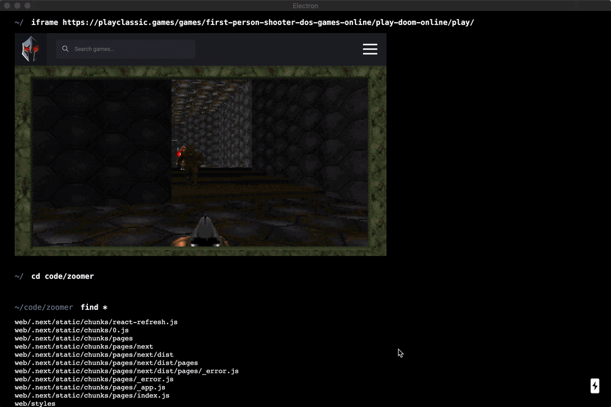

<h1 align="center">Termy</h1>

  An easy to use terminal built on web technologies with a shell built for structured data

  

 

  <a href="http://discord.com/invite/tzrRhdZ"><strong>Discord</strong></a> •
  <a href="#motivation"><strong>Motivation</strong></a> •
  <a href="#development"><strong>Development</strong></a>

 

## Features

- Autosuggestions

- Structured data piping

- Rich HTML based UI

## Motivation

Terminals can be scary at first. Termy aims to be a beginner-friendly, easy to use tool for developers just starting out. But we think more experienced developers will find it helpful too.

> ⚠️ **Termy is currently in alpha.** Many features don't work yet. Click on _watch_ to get notified about new releases.

#### License

Termy is <a href="LICENSE">MIT licensed</a>.

